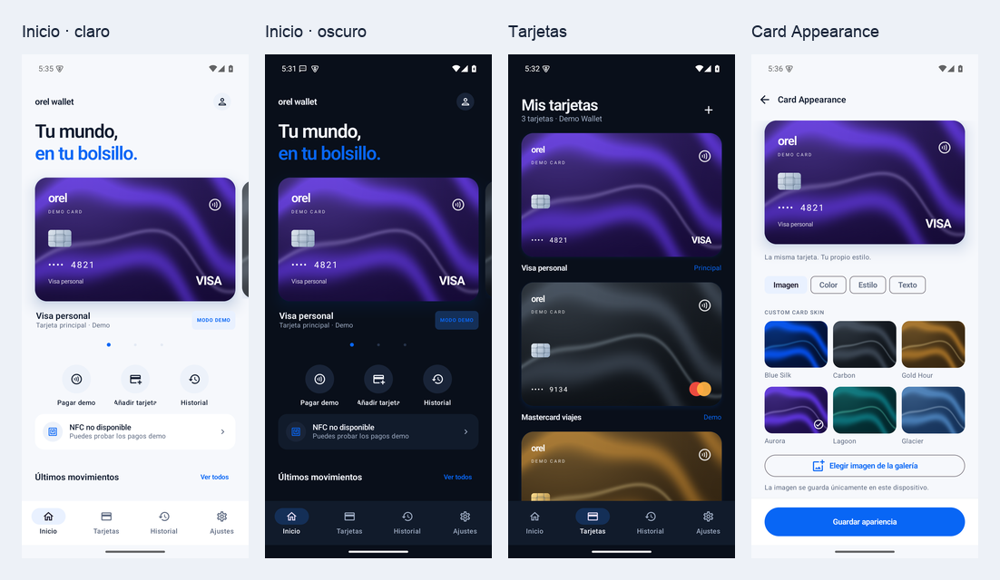

# Orel Wallet

Wallet Android nativa con Kotlin, Jetpack Compose y Material 3. Tarjetas grandes, carrusel con gestos, personalización visual, historial local, temas claro/oscuro y un flujo completo de compra **DEMO**.

**Demo Mode does not perform real payments.** Esta APK no añade tarjetas bancarias, no funciona como una tarjeta de pago ante un TPV y no realiza cargos. Todas las tarjetas y transacciones iniciales son ficticias; las tarjetas Visa, Mastercard y Amex están marcadas como DEMO.



## Ejecutar

Requisitos: Android Studio, JDK 17, SDK Android 35 y Android 11/API 30 o superior. NFC es opcional. La combinación de versiones está fijada en Gradle; el wrapper está incluido.

1. Abrir esta carpeta en Android Studio y seleccionar JDK 17 para Gradle.
2. Instalar SDK Platform 35 y Build Tools 35.0.0 desde SDK Manager.
3. Crear `local.properties` con `sdk.dir=/ruta/al/Android/sdk` (Android Studio lo genera automáticamente).
4. Ejecutar la configuración `app` sobre un emulador o dispositivo.

Desde terminal:

```sh
export JAVA_HOME=/ruta/al/jdk-17
./gradlew assembleDebug
./gradlew testDebugUnitTest lintDebug
adb install -r app/build/outputs/apk/debug/app-debug.apk
```

En este Mac se utiliza `/opt/homebrew/opt/openjdk@17/libexec/openjdk.jdk/Contents/Home` como JDK y `/Users/orel/Library/Android/sdk` como SDK. Estos paths no se fijan en archivos versionados de Gradle.

La APK generada se copia a `artifacts/orel-wallet-demo.apk`. Es una compilación debug firmada para pruebas, no una publicación de producción. `scripts/verify.sh` reproduce el build, pruebas unitarias y lint; con un dispositivo conectado también puede ejecutarse `./gradlew connectedDebugAndroidTest`.

## Probar el modo demo

- Pulsar **Comenzar**. Cuando se solicita desbloqueo, usar la biometría/PIN de Android. Si el dispositivo no tiene credencial configurada, el botón indica explícitamente que desbloquea solo la demo.
- Deslizar las tarjetas, tocar los indicadores o abrir **Tarjetas** para seleccionar una.
- Abrir los detalles → **Card Appearance**. Elegir una skin original, una imagen de la galería, color o gradiente. Ajustar brillo, contraste, chip, posición, tipografía y nombre; guardar.
- Añadir una tarjeta demo; renombrar, reorganizar, cambiar la principal, bloquear, ocultar o eliminar desde sus detalles. Las tarjetas regalo/fidelidad son ejemplos locales, sin saldo canjeable ni integración con comercios.
- Pulsar **Pagar demo**. Autorizar con Android; si no existe autenticación configurada, usar **Simular autenticación · Demo**. Si la preferencia de autenticación está desactivada, la continuación también se identifica como simulación.
- Pulsar **Simular compra de 12,50 €**. `DemoPaymentService` obtiene una confirmación local y después persiste el movimiento. El resultado siempre indica que no hubo un cargo.
- Buscar movimientos por comercio, tarjeta o últimos dígitos; filtrar en línea/en tienda y abrir detalles.
- Cambiar tema, color de acento, bloqueo y contactless desde Ajustes. Las preferencias de notificaciones se guardan para una integración futura; esta versión no envía notificaciones del proveedor. Analíticas y envío de errores permanecen desactivados.

Los datos sobreviven al reinicio. Eliminar todas las tarjetas no vuelve a crear automáticamente las iniciales. Para volver al estado de fábrica, borrar los datos de la app desde Android o ejecutar `adb shell pm clear com.orel.wallet` en el dispositivo de pruebas.

## Arquitectura

```text
app/src/main/java/com/orel/wallet/
├── domain/        Card, CardAppearance, PaymentToken, Transaction, WalletSettings
├── data/          Room, entidades/mapeos, seed demo y repositorio en memoria
├── wallet/        contrato de repositorio e invariantes compartidas
├── payments/      sesiones, estados, proveedor demo e interfaces futuras
├── security/      BiometricPrompt, codec opaco, Keystore y protección de capturas
├── nfc/           disponibilidad, puerta temporal y protocolo HCE de laboratorio
├── presentation/  WalletViewModel, StateFlow y pantallas Compose
├── navigation/    Navigation Compose y ciclo de vida
└── ui/            tema, tarjetas y componentes reutilizables
backend/           servidor mock local independiente
```

MVVM con separación de presentación, dominio y datos. La inyección de dependencias explícita en `WalletApplication` comparte un repositorio Room y un servicio demo; no requiere un framework DI. Las mutaciones de tarjetas y registros son transaccionales. Los tests del repositorio en memoria usan las mismas invariantes que Room.

`Card.network`, `last4` e `isDemo` son identidad; `CardAppearance` es estética. Actualizar apariencia no puede modificar esos campos. No existen campos `fullPan` o `cvv` en los modelos persistidos. Las imágenes elegidas se copian a `noBackupFilesDir/card-images` con tamaño limitado y nombre generado, sin permisos amplios de almacenamiento.

Estados: `IDLE`, `SELECTING_CARD`, `AUTHENTICATING`, `READY_TO_PAY`, `PROCESSING`, `SUCCESS`, `FAILED`, `CANCELLED`. Una sesión autorizada caduca; se vuelve a comprobar la tarjeta al ejecutar y al recibir la confirmación. `SUCCESS` solo se publica después de confirmación del proveedor y escritura del historial. Cancelar antes del punto de commit no crea movimiento; una confirmación que ya está entrando al commit se conserva. Ejecutar de nuevo la misma sesión confirmada no duplica su transacción.

## Biometría y seguridad

Se utiliza `androidx.biometric.BiometricPrompt` con `BIOMETRIC_STRONG | DEVICE_CREDENTIAL` (min API 30). Huella/rostro dependen de las capacidades y de la clase de seguridad del dispositivo; Android gestiona el PIN/password de fallback. La app no almacena huellas ni PINs. La simulación de autenticación está separada y etiquetada como DEMO.

El estado de bloqueo vive en ViewModel y sobrevive a rotaciones. Una nueva instancia del proceso requiere desbloquear cuando la preferencia de autenticación está habilitada. Se usa reloj monotónico para el bloqueo al regresar del fondo. Los pagos y el desbloqueo protegen capturas con `FLAG_SECURE`.

`CardTokenStore` cifra **referencias opacas del proveedor** con AES-GCM y clave no exportable de Android Keystore. No es un almacén de PAN/CVV ni una implementación de credenciales EMV. Usa IV aleatorio, nombre de referencia autenticado y almacenamiento excluido de backup. El codec rechaza referencias que parezcan números bancarios. El demo no necesita tokens bancarios. No se registran secretos ni hay permiso de red en la APK. Las copias de seguridad están desactivadas.

No hay certificate pinning porque no hay backend de pagos configurado. Una integración real deberá definir su propio modelo de amenazas, autenticación, transporte y requisitos del proveedor.

## NFC y HCE de laboratorio

Se comprueba realmente la existencia de `NfcAdapter`, su estado y `FEATURE_NFC_HOST_CARD_EMULATION`. No se exige NFC para instalar o probar la demo. El emulador permite probar la interfaz de ausencia de NFC; el intercambio físico necesita hardware.

El servicio HCE utiliza categoría **other**, permiso de enlace `BIND_NFC_SERVICE` y desbloqueo del dispositivo. El AID de laboratorio es **F04F52454C01**, distinto de AIDs bancarios. Solo responde cuando la pantalla de pago mantiene una sesión demo autorizada, NFC activado y contactless habilitado. La credencial vive en memoria como `DEMO:<session-id>`, caduca en un máximo de 30 segundos y se revoca al cancelar, procesar, completar o pasar al fondo.

Para probar con un lector ISO-DEP de laboratorio, mientras la pantalla indica demo lista:

```text
SELECT AID:       00 A4 04 00 06 F0 4F 52 45 4C 01
Respuesta:        "OREL DEMO LAB" + 90 00
READ credential:  80 CA 00 00 00
Respuesta:        "DEMO:<session-id>" + 90 00
Sin autorización: 69 85
AID desconocido:  6A 82 (con sesión autorizada)
Comando inválido:  6D 00 (tras SELECT autorizado)
```

Leer la credencial no confirma una compra ni registra un pago. No se implementan PPSE, EMV, PAN, claves de red ni una tarjeta bancaria falsa. Un TPV bancario no puede utilizar esta credencial. El protocolo puro se verifica con tests; NFC físico queda pendiente de disponer de un lector y dispositivo compatibles.

## Integración futura de pagos reales

`PaymentProvider`, `TokenizationProvider` y `CardProvisioningProvider` delimitan una segunda fase. `RealPaymentService` rechaza operaciones mientras no exista una integración autorizada; no finge éxito. No hay endpoints de bancos ni claves de ejemplo que parezcan credenciales reales.

Para añadir un proveedor:

1. Elegir un proveedor autorizado con programa de emisión/tokenización y soporte Android documentado.
2. Implementar sus contratos de provisioning, referencias de tokens y confirmaciones verificadas mediante su SDK/API oficial. No reutilizar el AID o protocolo HCE de demo.
3. Mantener las credenciales de pago en el componente seguro indicado por ese proveedor; guardar únicamente referencias opacas según su política.
4. Inyectar una implementación real separada del servicio demo, distinguir tarjetas reales/demo en UI y bloquear una sesión real cuando el proveedor no esté disponible.
5. Reemplazar la autenticación de demostración por autorización ligada criptográficamente a la sesión real, según las exigencias del proveedor, con idempotencia y confirmación de backend.
6. Añadir las pruebas, auditoría y certificaciones requeridas antes de publicar o permitir cargos.

El mock de `backend/` reproduce únicamente contratos de laboratorio. No se conecta automáticamente a la APK y no puede convertirse en un servidor de pagos habilitando una variable. Ver [backend/README.md](backend/README.md).

## Pruebas y revisión

```sh
./gradlew assembleDebug testDebugUnitTest lintDebug
./gradlew connectedDebugAndroidTest
cd backend
npm test
```

Tests JVM: alta/borrado/default/orden/bloqueo, identidad/apariencia, mapeo Room, disponibilidad NFC, APDU y caducidad HCE, autorización, estados, confirmación, rechazo del proveedor, cancelación, timeout e idempotencia; validación de referencias de tokens. Tests Android: navegación, alta demo, apariencia persistente, historial, tema y pago demo sobre Room real. Las comprobaciones ejecutadas y límites se registran en [docs/VERIFICATION.md](docs/VERIFICATION.md).

Los fondos de las tarjetas son originales y se generan con [scripts/generate_skins.py](scripts/generate_skins.py), sin assets de Apple. No se garantiza una tasa de fotogramas concreta sin medir cada dispositivo; Compose usa transiciones breves y gestos nativos. Revisar animaciones, TalkBack y NFC en hardware representativo antes de producción.

## Fuentes de plataforma

- [BiometricPrompt y autenticadores de Android](https://developer.android.com/identity/sign-in/biometric-auth).
- [Host-based card emulation](https://developer.android.com/develop/connectivity/nfc/hce).
- [Android Keystore](https://developer.android.com/privacy-and-security/keystore).

Los avisos de dependencias figuran en [OPEN_SOURCE_NOTICES.md](OPEN_SOURCE_NOTICES.md). Los detalles de privacidad están en [PRIVACY.md](PRIVACY.md). `.gitignore` excluye secretos, certificados privados, keystores, `.env`, SDK local y artefactos de compilación.
